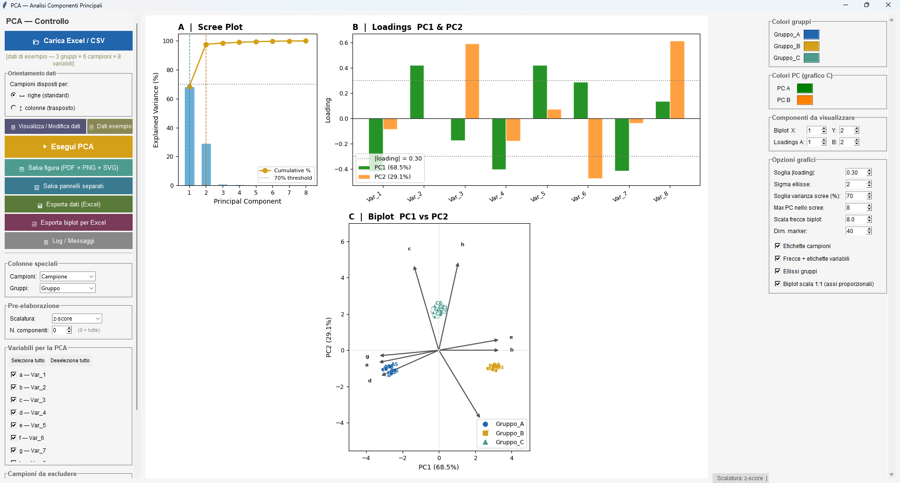

# PCA GUI

Desktop GUI (Python/tkinter) for Principal Component Analysis on tabular data — e.g. compound/
metabolite concentration profiles across sample groups (HPLC data, chemotaxonomy, quality
control), or any samples × variables dataset — producing publication-ready plots: scree plot,
loadings bar chart and biplot.



## Features

- Load data from Excel, in either orientation — samples as rows or samples as columns (with
  automatic transposition, see `trasponi.py`)
- Choose which variables to include and which samples to exclude, with per-group colors and
  distinct markers (up to 6 groups)
- Several scaling methods: z-score, mean-centering, min-max, robust, or none
- Automatic handling of missing values (mean imputation, with a warning)
- Three linked plots in one figure: scree plot (explained/cumulative variance), loadings bar
  chart, and biplot (scores + loading vectors + group confidence ellipses)
- Editable spreadsheet view of the loaded/transformed data
- Export: full figure or individual panels (PDF/PNG/SVG), scores/loadings/variance to Excel, or a
  ready-to-plot Excel workbook (separate sheets for scores, loading arrows, group ellipses) for
  building the same chart natively in Excel
- `Edit Figure...` reopens any one panel (scree / loadings / biplot) in PlotStyleKit's standalone
  figure editor for titles, per-element styling and publication-size export; `Salva figura
  (pickle)...` saves a panel as a live, re-editable `Figure` object instead of a raster image — see
  Requirements below

## Requirements

```
pip install -r requirements.txt
```

```
numpy, pandas, scikit-learn, matplotlib, openpyxl
adjustText   # optional — avoids overlapping labels in the biplot
```

[PlotStyleKit](https://github.com/milanone/PlotStyleKit) is an optional sibling repo (cloned as
`../PlotStyleKit` next to this project) providing the shared Origin-like plot style and the
standalone figure editor behind `Edit Figure...` / `Salva figura (pickle)...`; without it those two
buttons are unavailable and the app uses default matplotlib styling.

See [`installa_pca_gui.txt`](installa_pca_gui.txt) for a step-by-step Windows/PowerShell setup
guide (Italian).

## Running

```
pythonw pca_gui.pyw
```

Double-clicking the `.pyw` file on Windows works too (no console window).

## Input file formats

**Standard layout** — first row is the header, one sample per row:

```
Sample | Group | Variable1 | Variable2 | …
F1     | F     | 38.5      | 466.4     | …
F2     | F     | 0.03      | 370.7     | …
```

**Transposed layout** — samples arranged in columns, detected and converted automatically:

```
Samples  | F1   | F2   | … | SD6
Groups   | F    | F    | … | SD
Compound1| 38.5 | 0.03 | … | 0.07
Compound2| 466  | 370  | … | 240
```

`trasponi.py` converts a transposed file to the standard layout on its own (useful for sharing
data with colleagues):

```
python trasponi.py <transposed_file.xlsx> [output_file.xlsx]
```

## Tests

```
python -m unittest discover -s tests -v
```

The tests open a hidden Tk window (they are skipped when tkinter or a display is not available),
run the PCA on the built-in example data and check the results against scikit-learn: explained
variance, orthonormal loadings, group separation, excluded samples, missing-value imputation and
the scaling options. They also check that the standard and transposed layouts give the same table
and that the app runs when the PlotStyleKit sibling repo is missing.

## Security note

`Salva figura (pickle)...` writes Python pickle files, and `Edit Figure...` in PlotStyleKit opens
them. A pickle can run arbitrary code when it is loaded, so open only figure files you created
yourself or received from someone you trust.

## Structure

- `pca_gui.pyw` — main application (a single `PCAApp` class)
- `trasponi.py` — standalone converter, transposed layout → standard layout
- `installa_pca_gui.txt` — Windows setup guide (Italian)
- `tests/test_pca_core.py` — unit tests (see Tests)
- `requirements.txt` — Python dependencies

## License

[MIT](LICENSE)
